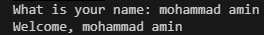
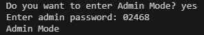
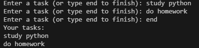

# Personal Task Manager


A simple task management application developed using Python. It allows users to enter tasks, display them, and save them in a text file. It also includes a basic Admin Mode with password checking.

## Table of Contents

* [Features](#features)
* [Project Structure](#project-structure)
* [File Description](#file-description)
* [Requirements](#requirements)
* [Installation](#installation)
* [Environment Setup](#environment-setup)
* [Usage](#usage)
* [Example Output](#example-output)
* [Screenshot](#screenshot)
* [Demo](#demo)
* [Roadmap](#roadmap)
* [Contributing](#contributing)
* [License](#license)
* [Author](#author)

## Features

* Add tasks
* Display all entered tasks
* Save tasks in a text file
* Welcome message using the user's name
* Basic Admin Mode with password checking

## Project Structure

```text
personal_task_manager/
├── main.py
├── tasks.py
├── .gitignore
├── .env.example
├── requirements.txt
├── README.md
├── pictures/
└── gifs/
```

## File Description

| File             | Description                                         |
| ---------------- | --------------------------------------------------- |
| main.py          | Main program and user interaction                   |
| tasks.py         | Functions for adding, displaying, and saving tasks  |
| .gitignore       | Specifies files that Git should ignore              |
| .env.example     | Example environment variable for the admin password |
| requirements.txt | Contains the project dependencies                   |
| README.md        | Project documentation                               |
| pictures/        | Contains project screenshots                        |
| gifs/            | Contains the demo GIF                               |

## Requirements

* Python 3
* python-dotenv

## Installation

1. Clone the repository.
2. Open the project folder.
3. Install the required package:

```bash
pip install -r requirements.txt
```

## Environment Setup

1. Create a file named `.env` in the project directory.
2. Add the following environment variable to the file:

```text
TASK_MANAGER_ADMIN_PASSWORD=your_password_here
```

3. Replace `your_password_here` with your own password.

Do not upload the `.env` file to GitHub.

## Usage

Run the program using:

```bash
python main.py
```

Enter your name and choose whether to enter Admin Mode. If you enter Admin Mode, type the admin password. Then enter your tasks one by one. Type `end` to finish entering tasks.

The program displays the tasks and saves them in `tasks.txt`.

## Example Output

```text
What is your name: Mohammad
Welcome, Mohammad
Do you want to enter Admin Mode? yes
Enter admin password: ********
Admin Mode
Enter a task (or type end to finish): Study Python
Enter a task (or type end to finish): Do homework
Enter a task (or type end to finish): end
Your tasks:
Study Python
Do homework
```

## Screenshot

### Welcome


### Admin mode


### Task



## Demo


## Roadmap

* Add task priorities
* Improve task management features

## Contributing

## License

## Author

Mohammad Amin Vahedi
